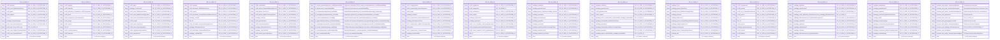

# Architecture des données

```mermaid
erDiagram
    OSI_01_REN_01 {
        string cr446_quantite "OSI_01_REN_01_NCDSDSINM_01"
        string cr446_cuve_BulkDeleteFailures "OSI_01_REN_01_NCDSDSINM_03"
        string cr446_poids "OSI_01_REN_01_NCDSDSINM_04"
        string cr446_espece "OSI_01_REN_01_NCDSDSINM_05"
        string OSI_05 "OSI_01_REN_01_NCDSDSINM_06"
        string smallapp_foulonretannage "OSI_01_REN_01_NCDSDSINM_07"
        string cr446_cuve_AsyncOperations "OSI_01_REN_01_NCDSDSINM_09"
        string cr446_cqfr_Cuve_cr446_cuve "OSI_01_OSRI_04"
        string cr446_cuve_MailboxTrackingFolders "OSI_01_REN_01_NCDSDSINM_10"
        string cr446_cuve_ProcessSession "OSI_01_REN_01_NCDSDSINM_11"
        string other "... et 32 autres colonnes"
    }
    OSI_01_OSRI_01 {
        string cr446_quantite "OSI_01_REN_01_NCDSDSINM_01"
        string cr446_datedder "OSI_01_OSRI_01_NCDSDSINM_01"
        string cr446_affectation_Programme_cr446_programme "OSI_01_OSRI_02"
        string cr446_poids "OSI_01_REN_01_NCDSDSINM_04"
        string cr446_programme_AsyncOperations "OSI_01_REN_01_NCDSDSINM_09"
        string cr446_progid "OSI_01_OSRI_01_NCDSDSINM_02"
        string cr446_espece "OSI_01_REN_01_NCDSDSINM_05"
        string OSI_05 "OSI_01_REN_01_NCDSDSINM_06"
        string cr446_commentaireprog "OSI_01_REN_01_NCDSDSINM_22"
        string cr446_datecave "OSI_01_OSRI_01_NCDSDSINM_03"
        string other "... et 33 autres colonnes"
    }
    OSI_05_OSRI_01 {
        string cr446_photo "OSI_05_OSRI_01_NCDSDSINM_01"
        string smallapp_CuveLezard "OSI_05_OSRI_01_NCDSDSINM_02"
        string cr446_essai_BulkDeleteFailures "OSI_01_REN_01_NCDSDSINM_03"
        string cr446_essai_MailboxTrackingFolders "OSI_01_REN_01_NCDSDSINM_10"
        string cr446_essai_DuplicateMatchingRecord "OSI_05_OSRI_01_NCDSDSINM_03"
        string cr446_essaiid "OSI_05_OSRI_01_NCDSDSINM_04"
        string cr446_essai_SyncErrors "OSI_01_REN_01_NCDSDSINM_49"
        string cr446_essai_AsyncOperations "OSI_01_REN_01_NCDSDSINM_09"
        string cr83b_complementpiecesjointes "OSI_05_OSRI_01_NCDSDSINM_05"
        string cr446_numeroessai "OSI_05_OSRI_01_NCDSDSINM_06"
        string other "... et 20 autres colonnes"
    }
    OSI_01_OSRI_02 {
        string cr446_quantite "OSI_01_REN_01_NCDSDSINM_01"
        string cr446_affectation_BulkDeleteFailures "OSI_01_REN_01_NCDSDSINM_03"
        string cr446_espece "OSI_01_REN_01_NCDSDSINM_05"
        string cr446_affectation_PrincipalObjectAttributeAccesses "OSI_01_REN_01_NCDSDSINM_32"
        string smallapp_LotAchat "OSI_05_OSRI_01_NCDSDSINM_11"
        string OSI_18 "OSI_01_OSRI_02_NCDSDSINM_01"
        string cr446_affectation_DuplicateMatchingRecord "OSI_01_OSRI_02_NCDSDSINM_02"
        string smallapp_AffectationLotCuve "OSI_05_OSRI_01_NCDSDSINM_13"
        string cr446_affectation_DuplicateBaseRecord "OSI_01_OSRI_02_NCDSDSINM_03"
        string smallapp_LotAchatTaille "OSI_05_OSRI_01_NCDSDSINM_12"
        string other "... et 12 autres colonnes"
    }
    OSI_22_REN_01 {
        string cr83b_codedefautc "OSI_22_REN_01_NCDSDSINM_01"
        string cr446_defaut_DuplicateMatchingRecord "OSI_22_REN_01_NCDSDSINM_02"
        string cr446_defaut_SyncErrors "OSI_01_REN_01_NCDSDSINM_49"
        string cr446_defaut_MailboxTrackingFolders "OSI_01_REN_01_NCDSDSINM_10"
        string smallapp_LotAchat "OSI_05_OSRI_01_NCDSDSINM_11"
        string cr446_photodefautid "OSI_22_REN_01_NCDSDSINM_03"
        string cr446_commentairedefaut "OSI_05_OSRI_01_NCDSDSINM_15"
        string smallapp_AffectationLotCuve "OSI_05_OSRI_01_NCDSDSINM_13"
        string smallapp_LotAchatTaille "OSI_05_OSRI_01_NCDSDSINM_12"
        string cr446_defaut_AsyncOperations "OSI_01_REN_01_NCDSDSINM_09"
        string other "... et 14 autres colonnes"
    }
    OSI_26_REN_01 {
        string lk_msdyn_pmcalendarversion_modifiedonbehalfby "Versions du calendrier PM (lk_msdyn_pmcalendarversion_modifiedonbehalfby)"
        string lk_businessunit_createdonbehalfby "Divisions (lk_businessunit_createdonbehalfby)"
        string lk_searchrelationshipsettings_modifiedby "SearchRelationshipSettings (lk_searchrelationshipsettings_modifiedby)"
        string lk_savedqueryvisualizationbase_createdby "Graphiques système (lk_savedqueryvisualizationbase_createdby)"
        string lk_searchcustomanalyzer_createdby "SearchCustomAnalyzer (lk_searchcustomanalyzer_createdby)"
        string lk_approvalstagecondition_createdonbehalfby "Conditions de la phase d’approbation (lk_approvalstagecondition_createdonbehalfby)"
        string lk_knowledgesourceprofile_modifiedonbehalfby "Knowledge Source Profiles (lk_knowledgesourceprofile_modifiedonbehalfby)"
        string lk_msdyn_aiodtrainingimage_modifiedby "AI Object Detection Image Mappings (lk_msdyn_aiodtrainingimage_modifiedby)"
        string lk_retentionoperation_modifiedonbehalfby "RetentionOperation (lk_retentionoperation_modifiedonbehalfby)"
        string lk_trait_modifiedonbehalfby "traits (lk_trait_modifiedonbehalfby)"
        string other "... et 2414 autres colonnes"
    }
    OSI_52_REN_01 {
        string cr446_commentaireid "OSI_01_REN_01_NCDSDSINM_22"
        string cr446_commentaire_AsyncOperations "OSI_01_REN_01_NCDSDSINM_09"
        string cr446_image "OSI_52_REN_01_NCDSDSINM_01"
        string smallapp_LotAchat "OSI_05_OSRI_01_NCDSDSINM_11"
        string cr446_commentaire_DuplicateBaseRecord "OSI_52_REN_01_NCDSDSINM_02"
        string smallapp_AffectationLotCuve "OSI_05_OSRI_01_NCDSDSINM_13"
        string cr446_commentaire_MailboxTrackingFolders "OSI_01_REN_01_NCDSDSINM_10"
        string cr446_texte "OSI_52_REN_01_NCDSDSINM_03"
        string cr446_commentaire_ProcessSession "OSI_01_REN_01_NCDSDSINM_11"
        string smallapp_LotAchatTaille "OSI_05_OSRI_01_NCDSDSINM_12"
        string other "... et 11 autres colonnes"
    }
    OSI_01_OSRI_03 {
        string cr446_pxaaffecter "OSI_01_OSRI_03_NCDSDSINM_01"
        string cr446_designation "OSI_18_OSNM_04"
        string cr446_codeespece "OSI_01_OSRI_03_NCDSDSINM_02"
        string cr446_cdvliee "OSI_01_OSRI_03_NCDSDSINM_03"
        string smallapp_casiercheck "OSI_01_OSRI_03_NCDSDSINM_04"
        string smallapp_datecasier "OSI_01_OSRI_03_NCDSDSINM_05"
        string cr446_cuve_ProgAval_cr446_programmeaval "OSI_01_OSRI_03_NCDSDSINM_06"
        string cr446_programmeaval_BulkDeleteFailures "OSI_01_REN_01_NCDSDSINM_03"
        string cr446_essai_ProgAval_cr446_programmeaval "OSI_05_OSRI_01"
        string OSI_10 "OSI_01_OSRI_01_NCDSDSINM_18"
        string other "... et 39 autres colonnes"
    }
    OSI_05_OSRI_02 {
        string smallapp_identifiant "OSI_05_OSRI_02_NCDSDSINM_01"
        string smallapp_quantitechoix1 "OSI_05_OSRI_02_NCDSDSINM_02"
        string smallapp_peaux_LotAchat_smallapp_lotachat "OSI_10_OSRI_01"
        string smallapp_quantitebc "OSI_05_OSRI_02_NCDSDSINM_03"
        string smallapp_quantiterecue "OSI_05_OSRI_02_NCDSDSINM_04"
        string smallapp_quantitefc "OSI_05_OSRI_02_NCDSDSINM_05"
        string smallapp_numerolot "OSI_05_OSRI_02_NCDSDSINM_06"
        string smallapp_lotachat_MailboxTrackingFolders "OSI_01_REN_01_NCDSDSINM_10"
        string smallapp_quantitechoix2 "OSI_05_OSRI_02_NCDSDSINM_07"
        string smallapp_lotachat_SyncErrors "OSI_01_REN_01_NCDSDSINM_49"
        string other "... et 21 autres colonnes"
    }
    OSI_05_OSRI_04 {
        string smallapp_identifiant "OSI_05_OSRI_02_NCDSDSINM_01"
        string smallapp_quantitechoix1 "OSI_05_OSRI_02_NCDSDSINM_02"
        string cr446_quantiterejetee "OSI_05_OSRI_02_NCDSDSINM_10"
        string cr446_espece "OSI_01_REN_01_NCDSDSINM_05"
        string smallapp_cr446_commentaire_LotAchatTaille_smallapp_lotachattaille "OSI_52_REN_01"
        string smallapp_lotachattaille_BulkDeleteFailures "OSI_01_REN_01_NCDSDSINM_03"
        string smallapp_quantitebc "OSI_05_OSRI_02_NCDSDSINM_03"
        string smallapp_lotachattaille_MailboxTrackingFolders "OSI_01_REN_01_NCDSDSINM_10"
        string smallapp_quantitefc "OSI_05_OSRI_02_NCDSDSINM_05"
        string smallapp_peaux_LotAchatTaille_smallapp_lotachattaille "OSI_10_OSRI_01"
        string other "... et 20 autres colonnes"
    }
    OSI_10_OSRI_01 {
        string smallapp_Cuve "OSI_10_OSRI_01_NCDSDSINM_01"
        string smallapp_peaux_SyncErrors "OSI_01_REN_01_NCDSDSINM_49"
        string smallapp_peaux_MailboxTrackingFolders "OSI_01_REN_01_NCDSDSINM_10"
        string smallapp_decoupe "OSI_01_OSRI_01_NCDSDSINM_18"
        string smallapp_taillecroute "OSI_10_OSRI_01_NCDSDSINM_02"
        string smallapp_peaux_PrincipalObjectAttributeAccesses "OSI_01_REN_01_NCDSDSINM_32"
        string smallapp_emplacementcroute "OSI_10_OSRI_01_NCDSDSINM_03"
        string smallapp_choixhermes "OSI_10_OSRI_01_NCDSDSINM_04"
        string smallapp_peaux_DuplicateBaseRecord "OSI_10_OSRI_01_NCDSDSINM_05"
        string smallapp_rfid "OSI_10_OSRI_01_NCDSDSINM_06"
        string other "... et 12 autres colonnes"
    }
    OSI_01_OSRI_04 {
        string cr446_homogeneite "OSI_01_OSRI_04_NCDSDSINM_01"
        string cr446_quantite "OSI_01_REN_01_NCDSDSINM_01"
        string cr446_cqfr_DuplicateBaseRecord "OSI_01_OSRI_04_NCDSDSINM_02"
        string cr446_espece "OSI_01_REN_01_NCDSDSINM_05"
        string OSI_05 "OSI_01_REN_01_NCDSDSINM_06"
        string OSI_66 "OSI_01_OSRI_04_NCDSDSINM_03"
        string cr446_spectro "OSI_01_OSRI_04_NCDSDSINM_04"
        string smallapp_quantiterebutrejet "OSI_01_OSRI_04_NCDSDSINM_05"
        string cr446_numero "OSI_01_OSRI_04_NCDSDSINM_06"
        string cr446_brillance "OSI_01_OSRI_04_NCDSDSINM_07"
        string other "... et 28 autres colonnes"
    }
    OSI_59_OSRI_01 {
        string smallapp_identifiant "OSI_05_OSRI_02_NCDSDSINM_01"
        string smallapp_quantitechoix1 "OSI_59_OSRI_01_NCDSDSINM_01"
        string cr446_espece "OSI_01_REN_01_NCDSDSINM_05"
        string smallapp_cr446_affectation_AffectationLotCuve_smallapp_affectationlotcuve "OSI_01_OSRI_02"
        string smallapp_affectationlotcuve_DuplicateMatchingRecord "OSI_59_OSRI_01_NCDSDSINM_02"
        string smallapp_quantitebc "OSI_05_OSRI_02_NCDSDSINM_03"
        string smallapp_quantitefc "OSI_05_OSRI_02_NCDSDSINM_05"
        string smallapp_quantitechoix2 "OSI_59_OSRI_01_NCDSDSINM_03"
        string smallapp_LotAchat "OSI_05_OSRI_02_NCDSDSINM_14"
        string smallapp_affectationlotcuve_AsyncOperations "OSI_01_REN_01_NCDSDSINM_09"
        string other "... et 15 autres colonnes"
    }
    OSI_05_OSRI_05 {
        string smallapp_quantitemae "OSI_05_OSRI_05_NCDSDSINM_01"
        string smallapp_quantitechoix1 "OSI_59_OSRI_01_NCDSDSINM_01"
        string smallapp_etapeauto "OSI_05_OSRI_05_NCDSDSINM_02"
        string smallapp_cuvelezard_BulkDeleteFailures "OSI_01_REN_01_NCDSDSINM_03"
        string smallapp_poids "OSI_01_REN_01_NCDSDSINM_04"
        string smallapp_foulonretannage "OSI_01_REN_01_NCDSDSINM_07"
        string smallapp_cuvelezard_AsyncOperations "OSI_01_REN_01_NCDSDSINM_09"
        string smallapp_quantitebc "OSI_05_OSRI_02_NCDSDSINM_03"
        string smallapp_cuvelezard_MailboxTrackingFolders "OSI_01_REN_01_NCDSDSINM_10"
        string smallapp_foulontannage "OSI_01_REN_01_NCDSDSINM_17"
        string other "... et 23 autres colonnes"
    }
    OSI_76_REN_01 {
        string business_unit_msdyn_serviceconfiguration "Configurations de service"
        string business_unit_msfp_unsubscribedrecipient "Destinataires désabonnés de Customer Voice"
        string business_unit_msdyn_favoriteknowledgearticle "Articles favoris de la base de connaissances"
        string business_unit_flowsession "Sessions de flux"
        string business_unit_cr446_cqfr "OSI_01_OSRI_04"
        string business_unit_powerpagessourcefile "Fichiers source du site"
        string business_unit_msdyn_analysisresultdetail "Détails des résultats d’analyse"
        string business_unit_smallapp_affectationlotcuve "OSI_05_OSRI_02_NCDSDSINM_17"
        string business_unit_annotations "Notes"
        string business_unit_msdyn_aiodtrainingboundingbox "AI Object Detection Bounding Boxes"
        string other "... et 369 autres colonnes"
    }
```