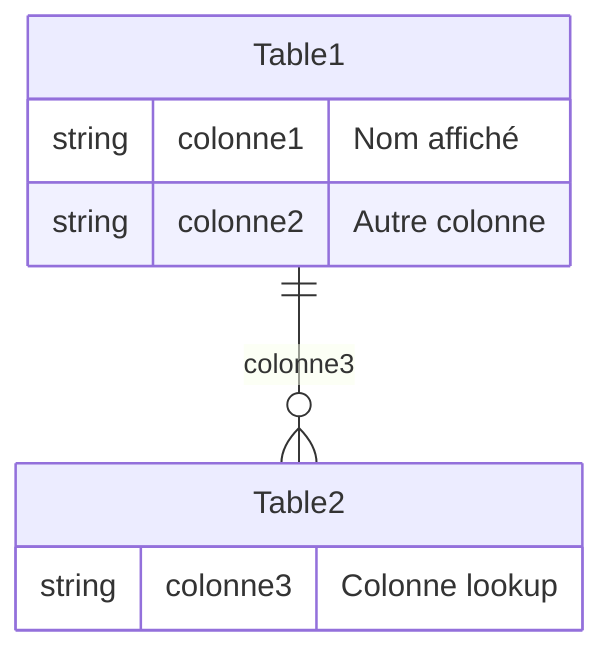

# 📊 Analyse et Documentation Power Apps (.msapp)

## Sommaire
1. [Introduction](#introduction)
2. [Décompression et exploration des fichiers](#décompression-et-exploration-des-fichiers)
3. [Analyse des DataSources](#analyse-des-datasources)
4. [Identification des relations](#identification-des-relations)
5. [Génération des exports](#génération-des-exports)
6. [Export Draw.io détaillé](#export-drawio-détaillé)
7. [Export HTML complet](#export-html-complet)
8. [Exports complémentaires](#exports-complémentaires)
9. [Scripts et automatisation](#scripts-et-automatisation)
10. [Conseils d'utilisation](#conseils-dutilisation)
11. [Conclusion](#conclusion)

---

## Introduction

Ce document présente une méthodologie complète pour analyser les fichiers Power Apps (.msapp) afin d'en extraire l'architecture des données. L'objectif est de comprendre la structure des entités, leurs relations et les listes de choix utilisées dans une application Power Apps.

### Contexte
Les fichiers .msapp sont des archives compressées contenant l'ensemble de la logique d'une application Power Apps. L'analyse de ces fichiers permet de :
- Documenter l'architecture existante
- Comprendre les dépendances entre entités
- Identifier les listes de choix et leurs valeurs
- Générer des diagrammes de documentation

### Périmètre couvert
- Extraction des DataSources
- Analyse des tables et colonnes
- Identification des relations
- Génération de multiples formats d'export
- Visualisation dans différents outils

---

## Décompression et exploration des fichiers

### Structure d'un fichier .msapp
Un fichier .msapp est une archive ZIP contenant :
```
├── App.fx.yaml
├── Controls/
├── Components/
├── DataSources/
│   └── DataSources.json
├── Assets/
└── References/
```

### Outils nécessaires
- **7-Zip** ou **WinRAR** pour la décompression
- **Python 3.x** pour l'analyse
- **Visual Studio Code** pour la visualisation
- **Draw.io** pour les diagrammes
- **Mermaid Live Editor** (optionnel)

### Étapes de décompression
1. Renommer le fichier `.msapp` en `.zip`
2. Extraire le contenu avec un outil de décompression
3. Localiser le fichier `DataSources/DataSources.json`

---

## Analyse des DataSources

### Structure du fichier DataSources.json
Le fichier contient un tableau d'objets représentant les sources de données :
```json
{
  "DataSources": [
    {
      "Type": "NativeCDSDataSourceInfo",
      "Name": "NomDeLaTable",
      "NativeCDSDataSourceInfoNameMapping": {
        "colonne_technique": "Nom affiché"
      }
    }
  ]
}
```

### Extraction des tables et colonnes
Le script Python analyse les éléments suivants :
- **Tables principales** : Type `NativeCDSDataSourceInfo`
- **Colonnes** : Via `NativeCDSDataSourceInfoNameMapping`
- **Listes de choix** : Type `OptionSetInfo`

### Filtres appliqués
**Tables exclues :**
- Divisions
- Utilisateurs

**Colonnes systèmes exclues :**
```python
excluded_columns = {
    "utcconversiontimezonecode", "_ownerid_value", "statuscode", "statecode",
    "modifiedonbehalfby", "createdonbehalfby", "owninguser", "timezoneruleversionnumber",
    "owningbusinessunit", "modifiedon", "modifiedby", "versionnumber",
    "overriddencreatedon", "createdby", "importsequencenumber", "owningteam", "createdon"
}
```

### Gestion des listes de choix (Option Sets)
Les listes de choix sont identifiées par :
- **Type** : `OptionSetInfo`
- **Mapping** : `OptionSetInfoNameMapping` (clé → valeur)
- **Références** : `OptionSetReference` (liens vers d'autres tables)

---

## Identification des relations

### Colonnes de type lookup (xxxid)
Les relations sont identifiées par :
- Colonnes se terminant par `id`
- Exemple : `customerid`, `productid`
- Correspondance avec les noms de tables (`customerid` → `Customers`)

### Références croisées entre entités
Via `OptionSetReference` :
```json
"OptionSetReference": {
  "OptionSetReferenceItem0": {
    "OptionSetReferenceEntityName": "TableCible",
    "OptionSetReferenceColumnName": "ColonneCible"
  }
}
```

### Analyse des OptionSetReference
- Identification des dépendances entre tables
- Traçabilité des listes de choix utilisées
- Documentation des usages multiples d'une même liste

---

## Génération des exports

### Formats disponibles
1. **Draw.io XML** : Diagramme visuel complet
2. **HTML** : Documentation interactive
3. **Mermaid** : Diagrammes ER
4. **JSON** : Structure complète pour analyse
5. **CSV** : Données tabulaires

### Spécificités de chaque export
- **Draw.io** : Relations visuelles, couleurs, positionnement
- **HTML** : Navigation, ancres, tables intégrées
- **Mermaid** : Syntaxe standard pour diagrammes
- **JSON** : Structure hiérarchique complète
- **CSV** : Facilité d'import dans Excel/Power BI

### Visualisation dans différents outils
- **Draw.io** : Import XML pour diagrammes interactifs
- **VS Code** : Prévisualisation Mermaid/HTML
- **Navigateur** : Ouverture directe HTML
- **Excel** : Import CSV pour analyse tabulaire

---

## Export Draw.io détaillé

### Structure du diagramme
Le diagramme généré comprend :
- **Tables principales** avec toutes leurs colonnes
- **Tables de choix** pour chaque liste de valeurs
- **Relations visuelles** entre tous les éléments
- **Codage couleur** pour la lisibilité

### Éléments visuels
**Couleurs utilisées :**
- **Tables principales** : Bleu clair (#e3f2fd)
- **Colonnes avec choix** : Orange clair (#fff3e0)
- **Tables de choix** : Violet clair (#f3e5f5)
- **Relations** :
  - Gris : Colonnes → Choix
  - Bleu : Relations entre tables
  - Orange : Références croisées

**Icônes et indicateurs :**
- 📋 devant les colonnes avec listes de choix
- Labels sur les flèches de relation
- Tri alphabétique des options

### Relations et connexions
1. **Colonnes → Tables de choix** : Flèches grises
2. **Tables liées** : Flèches bleues pour les `xxxid`
3. **Références croisées** : Lignes orange pointillées

### Optimisation du positionnement
- **Grille organisée** : 3 colonnes maximum
- **Espacement adaptatif** : Basé sur la hauteur des tables
- **Tables de choix** : Positionnées à droite sans chevauchement
- **Détection automatique** : Ajustement si position occupée

---

## Export HTML complet

### Structure du rapport
Le rapport HTML généré comprend :
- **Liste des tables** avec leurs colonnes
- **Tables de choix** intégrées avec valeurs
- **Références croisées** documentées
- **Navigation par ancres** pour faciliter l'utilisation

### Navigation et ancres
- **Ancres automatiques** vers chaque table
- **Liens vers les listes de choix**
- **Navigation fluide** dans le document
- **Structure hiérarchique** claire

### Tables de choix intégrées
Pour chaque colonne avec liste de choix :
- Lien vers la table de choix correspondante
- Tableau détaillé des valeurs possibles
- Tri alphabétique des options
- Indication du nombre de choix disponibles

### Références croisées
- **Section dédiée** aux références
- **Liens bidirectionnels** entre éléments
- **Documentation des usages multiples**
- **Traçabilité complète** des dépendances

---

## Exports complémentaires

### Mermaid pour diagrammes ER


**Avantages :**
- Syntaxe standardisée
- Visualisation en ligne
- Export vers images
- Intégration dans Markdown

### JSON structuré pour analyse
Structure complète :
```json
{
  "tables": {
    "NomTable": {
      "columns": {"col_technique": "col_affichée"},
      "option_sets": {"col": {"clé": "valeur"}}
    }
  },
  "relationships": [
    {
      "from_table": "Source",
      "to_table": "Cible",
      "column": "colonne",
      "type": "lookup"
    }
  ],
  "option_set_references": {}
}
```

### CSV pour traitement dans Excel/Power BI
Colonnes du CSV :
- Table
- Nom Technique
- Nom Affiché
- Avec Liste de Choix
- Références

**Avantages :**
- Traitement dans Excel
- Import dans Power BI
- Filtres et tris
- Analyses statistiques

---

## Scripts et automatisation

### Code Python principal
Le script principal gère :
1. **Lecture du fichier DataSources.json**
2. **Extraction des tables et colonnes**
3. **Analyse des listes de choix**
4. **Génération des exports sélectionnés**
5. **Gestion des erreurs et nettoyage**

### Fonctions utilitaires
```python
def clean_xml_text(text):
    """Nettoyer le texte pour XML"""
    return text.replace("&", "&amp;").replace("<", "&lt;")

def clean_mermaid_name(name):
    """Nettoyer les noms pour Mermaid"""
    cleaned = re.sub(r'[^a-zA-Z0-9_]', '_', name)
    return cleaned if cleaned else "unnamed_attr"
```

### Gestion des erreurs et nettoyage
- **Validation des structures JSON**
- **Gestion des caractères spéciaux**
- **Protection contre les index out of range**
- **Nettoyage des noms pour compatibilité**

---

## Conseils d'utilisation

### Bonnes pratiques
1. **Sauvegarder** le fichier original avant décompression
2. **Vérifier** la structure du DataSources.json
3. **Tester** avec un petit nombre de tables d'abord
4. **Documenter** les filtres personnalisés

### Limites et performances
- **Fichiers volumineux** : Peuvent ralentir Draw.io
- **Nombre élevé de relations** : Complexifie le diagramme
- **Caractères spéciaux** : Nécessitent un nettoyage
- **Mémoire** : Utilisation importante pour gros fichiers

### Personnalisation possible
- **Ajout de filtres** pour d'autres colonnes systèmes
- **Modification des couleurs** dans les exports
- **Ajout de nouveaux formats** d'export
- **Intégration** dans des pipelines automatisés

---

## Conclusion

### Récapitulatif des fonctionnalités
Ce projet permet d'analyser complètement une application Power Apps et de générer :
- **Diagrammes visuels** interactifs
- **Documentation HTML** complète
- **Exports tabulaires** pour analyse
- **Structures JSON** pour automatisation

### Évolutions possibles
- **Intégration Power BI** pour dashboard
- **Comparaison de versions** d'applications
- **Analyse de la complexité** des relations
- **Génération de documentation** automatique

### Ressources complémentaires
- **Documentation officielle Power Apps**
- **Mermaid Live Editor** : https://mermaid.live
- **Draw.io** : https://app.diagrams.net
- **Python documentation** : https://docs.python.org

---

*Document généré automatiquement à partir de l'analyse d'échange et de développement*

**Version** : 1.0
**Date** : 27/11/2025
**Auteur** : DomTa
